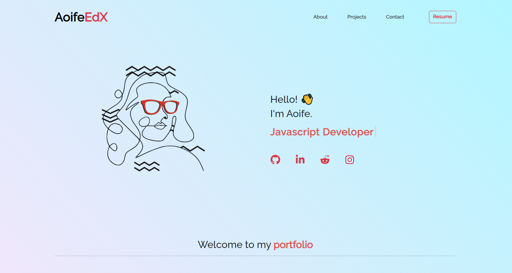

# My Portfolio Website

This is a simple portfolio website built using React.js. It showcases my projects, provides information about me, and allows visitors to contact me.

## Table of Contents

- [Demo](#demo)
- [Features](#features)
- [Technologies](#technologies)
- [License](#license)

## Demo

You can see a live demo of the website [here](https://www.example.com).

### Screenshot

## Credits

Instructions provided by EdX (Skills Boot Camp in Front-End Web Development). 
Icons from FontAwesome.

## Features

- **Project Gallery**: Displays projects dynamically fetched from a JSON file.
- **About Me**: Provides information about the website owner.
- **Contact Form**: Allows visitors to send messages directly to the website owner.
- **Responsive Design**: Ensures the website looks good on all devices.

## Technologies

- [React.js](https://reactjs.org/): Frontend framework for building user interfaces.
- [React Router](https://reactrouter.com/): Library for handling routing in React applications.
- [React Bootstrap](https://react-bootstrap.github.io/): UI library built on top of Bootstrap for React applications.
- [Vite](https://vitejs.dev/): Next-generation frontend tooling for modern web development.

## License

### MIT License

Copyright (c) 2024 AoifeEdX

Permission is hereby granted, free of charge, to any person obtaining a copy of this software and associated documentation files (the "Software"), to deal in the Software without restriction, including without limitation the rights to use, copy, modify, merge, publish, distribute, sublicense, and/or sell copies of the Software, and to permit persons to whom the Software is furnished to do so, subject to the following conditions:

The above copyright notice and this permission notice shall be included in all copies or substantial portions of the Software.

THE SOFTWARE IS PROVIDED "AS IS", WITHOUT WARRANTY OF ANY KIND, EXPRESS OR IMPLIED, INCLUDING BUT NOT LIMITED TO THE WARRANTIES OF MERCHANTABILITY, FITNESS FOR A PARTICULAR PURPOSE AND NONINFRINGEMENT. IN NO EVENT SHALL THE AUTHORS OR COPYRIGHT HOLDERS BE LIABLE FOR ANY CLAIM, DAMAGES OR OTHER LIABILITY, WHETHER IN AN ACTION OF CONTRACT, TORT OR OTHERWISE, ARISING FROM, OUT OF OR IN CONNECTION WITH THE SOFTWARE OR THE USE OR OTHER DEALINGS IN THE
SOFTWARE.
